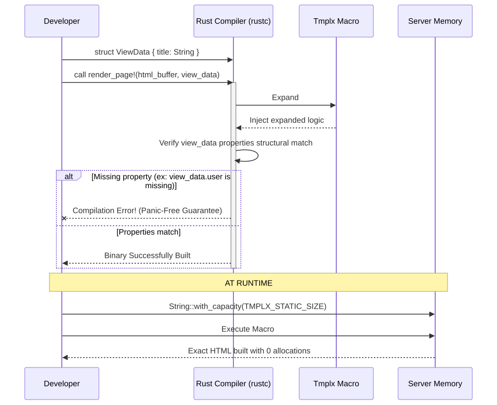

# Tmplx: High-performance HTML template engine

[English](README.md) | [Français](README.fr.md)

**Tmplx** is a brutally fast layout engine for Rust apps relying heavily on HTML interface precompilation. Driven strictly by structural typing (Duck-Typing), it generates high-performance rendering macros with no file caching or allocations at runtime.

### 1. The zero-allocation pipeline

Rather than interpreting strings during your HTTP server's runtime, Tmplx parses your HTML mockups during the compilation phase (via `build.rs`). It converts every static element into bare `output.push_str()` system calls and calculates the exact byte-size of your templates upfront.



**How to read this diagram:**

1. **Phase 1 (developer workflow)**: You write standard `.html` files in your text editor.
2. **Phase 2 (compile time via `build.rs`)**: Instead of shipping `.html` files to production, Tmplx parses them during compilation. It sums the exact byte size of all static characters and compresses the logic into a pure Rust macro (`render_macro!`).
3. **Phase 3 (runtime execution)**: When a user hits your blazing-fast server, your Rust binary already knows the exact capacity to pre-allocate (`String::with_capacity`). The HTML is rendered using direct pointer insertions pushing exactly 0 bytes to the heap.

The operational result: no `.html` file reading occurs in production. Your HTML markup takes precisely 0 bytes of dynamic memory allocation upon rendering.

### 2. Duck-typing (compile-time safety)

Tmplx doesn't force your Rust logic to derive from heavy, rigid ORM models. It uses structural typing ("Duck-Typing"). The macro simply asserts that your `ViewData` struct possesses the required public fields (like `title` or `email`) at the moment you call it.



**How to read this diagram:**

- **The inputs**: You pass a native Rust struct (`ViewData`) to the macro. Tmplx does not force you to inherit from complex ORM traits.
- **The structural match**: The `render_page!` macro acts as a strict firewall. It verifies that your `ViewData` possesses the exact public properties requested inside the HTML template (e.g. `{{ title }}`).
- **The guarantee**: If a developer alters a core database property and forgets to update the HTML, the Rust compiler (`rustc`) immediately panics **during the build**. You get a mathematically proven "Panic-free" guarantee in production.

---

## ⚡ Quickstart (Zero to hero) in 3 minutes

Want to see it work immediately? Follow these simple copy-paste steps to test Tmplx without any prior knowledge.

**1. Initialize your project**

```bash
cargo new my_blazing_fast_app
cd my_blazing_fast_app
mkdir templates
```

**2. Configure `Cargo.toml`**
_(Add these exact lines at the end of the file)._

```toml
[dependencies]
tmplx = "0.1"

[build-dependencies]
tmplx-compiler = "0.1"
```

**3. Create the build orchestrator (`build.rs`)**
_(Create a `build.rs` file at the root, exactly next to `Cargo.toml`)._

```rust
use std::env;
use std::path::PathBuf;

fn main() {
    println!("cargo:rerun-if-changed=templates");
    let out_dir = env::var("OUT_DIR").unwrap();
    let dest_path = PathBuf::from(out_dir).join("template_gen.rs");
    tmplx_compiler::build_workspace("templates", &dest_path);
}
```

**4. Create your first template (`templates/index.html`)**

```html
<h1>Welcome, {%%= view_data.pseudo %}!</h1>
```

**5. Execute the template in your `src/main.rs`**
_(Replace everything in `src/main.rs` with this code)._

```rust
// Automatically load macros generated during the build
pub mod generated {
    include!(concat!(env!("OUT_DIR"), "/template_gen.rs"));
}

// Our perfectly typed data struct
struct MyViewData {
    pseudo: String,
}

fn main() {
    let data = MyViewData { pseudo: "Arthur".to_string() };

    // Create our HTML buffer
    let mut html_output = String::new();

    // The magic happens here!
    generated::render_index!(&mut html_output, &data);

    println!("Generation successful:\n{}", html_output);
}
```

**6. Launch the magic!**

```bash
cargo run
```

You will instantly see your generated HTML in the console. You are ready to go further!

---

## Installation & configuration

Tmplx relies on a very specific compilation pipeline.

### 1. Enable Tmplx in your project

Add the production dependency and the dedicated compiler in your `Cargo.toml` file:

```toml
[dependencies]
tmplx = "0.1"

[build-dependencies]
tmplx-compiler = "0.1"
```

_(Cargo, Rust's package manager, will automatically download these dependencies securely from **crates.io** — the official registry —, then invisibly configure them on the next `cargo build`!)_

### 2. The build orchestrator (`build.rs`)

Tmplx compiles your pages **at the same time** as your Rust code. \
Create a `build.rs` file right at the root of your project (next to `Cargo.toml`) and copy/paste this ready-to-use code:

```rust
use std::env;
use std::path::PathBuf;

fn main() {
    // 1. Tell Cargo to rerun the build if an HTML file changes
    println!("cargo:rerun-if-changed=templates");

    // 2. Retrieve the hidden target folder generated by Rust ($OUT_DIR)
    let out_dir = env::var("OUT_DIR").expect("Missing OUT_DIR");
    let dest_path = PathBuf::from(out_dir).join("template_gen.rs");

    // 3. Launch the magic compilation: from pure HTML to native code
    tmplx_compiler::build_workspace("templates", &dest_path);
}
```

### 3. HTML templates folder

Create your mockups in the `templates/` folder (at the same level as the `src/` folder) with a simple file:

- `index.html` (Your layout)

---

## Syntax and interactive usage guide

Here, your HTML pages are written very simply with small dynamic tags formatted as ``. Tmplx parses this grammar to inject contextual intelligence.

### 1. Display variables (escaped & raw)

> ⚠️ **Global security (Raw by default)**: As an architectural choice aiming for absolute zero-allocation performance, Tmplx is **NOT** "safe by default" (unlike Askama or Tera). You **MUST** explicitly request data escaping using the double percent `%%`. Using the simple `` tag on untrusted user input will create a direct XSS vulnerability.

Tmplx provides two strict display modes:

- `{%%= view_data.user.name %}` **(Escaped / Secured)**: To use 99% of the time. This tag escapes dangerous HTML to protect your interfaces.
- `` **(Raw / Dangerous)**: Displays **exactly** the unaltered text (reserve this strictly for trusted server-generated HTML blocks).

```html
<h1>Welcome, {%%= view_data.user.name %}!</h1>
<!-- ⚠️ Must be secure and internally generated (e.g., compiled markdown) -->
<div></div>
```

### 2. Spatial control & whitespace (truncation)

If you want to eliminate inadvertent line breaks or whitespaces generated around tags, add a small hyphen (`-`):

- ``: Removes all static whitespace **after** the tag.

```html
<p> Logged in </p>
```

### 3. Conditional logic (`if`, `else if`, `else`)

Toggle HTML elements via your booleans clearly:

```html

<button>Admin Panel</button>

<span class="badge">Premium</span>

<span>Basic User</span>

```

_Tip: You can also test a negation with the exclamation mark (Ex: ``)._

**Alternative Brace Syntax (`{ }`)**:
For developers who prefer the Rust style, it is also possible to write your blocks with braces instead of keywords (`endif`):

```html

<p>Admin</p>

<p>Premium</p>

<p>Standard</p>

```

### 4. Iterate and loop (`for`)

Display HTML lists directly from lists (`Vec<T>` or slices) in Rust:

```html
<ul>
  
  <li>{%%= item.name %}</li>
  
</ul>
```

_(Similarly to the if statement, you can write `` and close with `` for a pure Rust feel!)_

**Advanced Mode "Magic Variables"**:
Within your loops, Tmplx passively makes powerful variables available:

- `loop_index`: The current iteration index, starting at `1`.
- `loop_index0`: The current iteration index, starting at `0` (very handy for UI calculations or JS).
- `loop_length`: What is the total size of my list? (e.g., `15`)
- `loop_first` / `loop_last`: Booleans that are true on the first or last element.

```html

<div class="{% if loop_index % 2 == 0 %}evenodd">
  Message  out of 
</div>

```

### 5. Local assignment (`let`)

Pre-calculate or manipulate a server-side variable without altering your core component logic:

```html

<span>Period: {%%= formatted_date %}</span>
```

### 6. Invisible comments (`{# ... #}`)

Leave notes without polluting the user interface or the network.
Unlike HTML comments (`<!-- -->`), Tmplx comments are **absolutely not** part of the final binary (they count for 0 bytes) and vanish at compile-time.

```html
{# FIXME: This block needs to be refactored in the next update #}
```

### 7. Modular architecture (`extends` & `block` inheritance)

Easily manage master "layouts" (no more copy/pasting!):

**The master file (`layout.html`):**

```html
<!DOCTYPE html>
<html>
  <head>
    <title>My Site</title>
  </head>
  <body>
    <nav>Main Menu</nav>
    <main></main>
  </body>
</html>
```

**The child page (`page.html`):**

```html
 
<h1>I am the content injected at the right place!</h1>

```

### 8. Reusable components (`include`)

Import sub-components without repeating yourself!

```html
<div>
  <h1>User Summary</h1>
  
</div>
```

---

### Duck typing & macros

Thanks to its new macro-oriented architecture (`#[macro_export]`), Tmplx has eliminated the need for `.toml` manifest files or manually generated explicit contracts.

The approach relies on compiled "Duck Typing" via a central argument called `view_data`, whose structure is entirely and natively checked by the **Rust** compiler (`rustc`) at the call site.
You simply insert variables prefixed with `view_data.` into your `index.html` file (example: `view_data.user.name` or `view_data.unread_count`).

If you use non-existent fields or calls on the `view_data` structure injected into the macro during execution, the compilation will fail immediately. Zero latent bugs in production, everything is syntactically guaranteed!

---

## Rust-side usage

### 4. Inclusion of magic code

To interact with your templates, Rust needs to retrieve this newly compiled code. In your main Rust code (e.g., `src/main.rs`), add the famous insertion macro at the top of the file:

```rust
// Retrieves our template macros from Cargo's hidden target folder ($OUT_DIR)
pub mod generated {
    include!(concat!(env!("OUT_DIR"), "/template_gen.rs"));
}
```

Here is how simple calling your generated page from your routes becomes via the generated Macro system:

```rust
// Let's invoke our newly created `render_dashboard` macro!
use generated::TMPLX_STATIC_SIZE_RENDER_DASHBOARD;
use crate::render_dashboard; // The macro is globally exported with #[macro_export]

fn show_page() -> String {
    // Disposable local or global struct (Duck Typing accommodates it)
    struct DashboardViewData {
        user: String,
        unread_count: usize,
    }

    // We prepare our strict View Aggregate
    let my_data = DashboardViewData {
        user: "Vincent".to_string(),
        unread_count: 12,
    };

    // Zero-Allocation Tip: We pre-allocate the exact required space instead of a blind "new()"!
    let mut html_output = String::with_capacity(TMPLX_STATIC_SIZE_RENDER_DASHBOARD + 100);

    // The miracle of macro compilation
    render_dashboard!(&mut html_output, &my_data);

    html_output
}
```

And that's it! The engine offers ideal traceability for your formidable speed Backend applications.
Happy coding!
